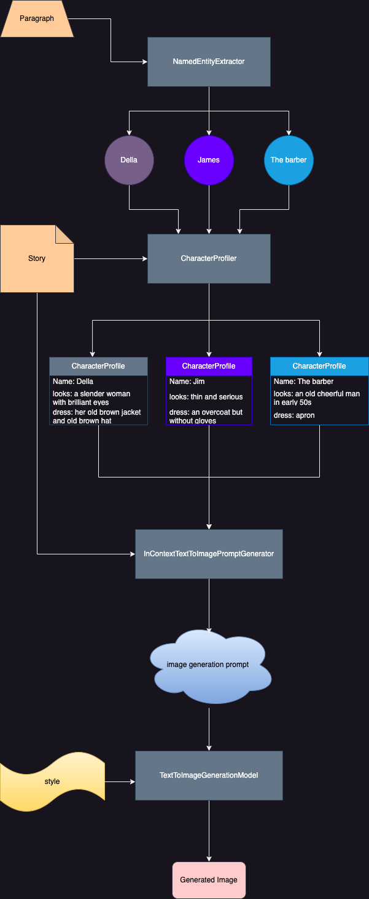

# GenAI-assisted Automatic Story Illustrator

Illustrate you stories for free: [](https://colab.research.google.com/github/soumik12345/diffusion-story-illustration/blob/main/examples/hosted_illustrate.ipynb)

This repository demonstrates a simple LLM-assisted workflow to illustrate paragraphs from short stories automatically using a text-to-image generation model. Although we use [GPT-4](https://platform.openai.com/docs/models/gpt-4-turbo-and-gpt-4) as the LLM and [FLUX.1-dev](https://huggingface.co/black-forest-labs/FLUX.1-dev) for generating the illustrations, the architecture is meant to be model-agnostic, i.e, the LLM calls and image generation models can be replaced with other models or services with similar capabilities.

You can read the blog post [Building a GenAI-assisted Automatic Story Illustrator](https://wandb.ai/geekyrakshit/story-illustration/reports/Building-a-GenAI-assisted-Automatic-Story-Illustrator--Vmlldzo5MTYxNTkw) to learn more about the architecture and shrtcomings of the current system and possible ways to improve it.

## Results

We used the automatic illustration workflow to illustrate the first ten paragraphs of the story [The Gift of the Magi](https://americanenglish.state.gov/files/ae/resource_files/1-the_gift_of_the_magi_0.pdf) by [O. Henry](https://en.wikipedia.org/wiki/O._Henry). Here are a few samples:

| Passage | Illustration |
|---|---|
|ONE DOLLAR AND eighty-seven cents. That was all. And sixty cents of it was in pennies. Pennies saved one and two at a time by bulldozing the grocer and the vegetable man and the butcher until one's cheeks burned with the silent imputation of parsimony that such close dealing implied. Three times Della counted it. One dollar and eighty-seven cents. And the next day would be Christmas.||
|There was clearly nothing to do but flop down on the shabby little couch and howl. So Della did it. Which instigates the moral reflection that life is made up of sobs, sniffles, and smiles, with sniffles predominating.||
|While the mistress of the home is gradually subsiding from the first stage to the second, take a look at the home. A furnished flat at $8 per week. It did not exactly beggar description, but it certainly had that word on the lookout for the mendicancy squad.||
|In the vestibule below was a letter-box into which no letter would go, and an electric button from which no mortal finger could coax a ring. Also appertaining thereunto was a card bearing the name “Mr. James Dillingham Young.” The “Dillingham” had been flung to the breeze during a former period of prosperity when its possessor was being paid $30 per week. Now, when the income was shrunk to $20, the letters of “Dillingham” looked blurred, as though they were thinking seriously of contracting to a modest and unassuming D. But whenever Mr. James Dillingham Young came home and reached his flat above he was called “Jim” and greatly hugged by Mrs. James Dillingham Young, already introduced to you as Della. Which is all very good.||
|Della finished her cry and attended to her cheeks with the powder rag. She stood by the window and looked out dully at a grey cat walking a grey fence in a grey backyard. Tomorrow would be Christmas Day, and she had only $1.87 with which to buy Jim a present. She had been saving every penny she could for months, with this result. Twenty dollars a week doesn't go far. Expenses had been greater than she had calculated. They always are. Only $1.87 to buy a present for Jim. Her Jim. Many a happy hour she had spent planning for something nice for him. Something fine and rare and sterling—something just a little bit near to being worthy of the honor of being owned by Jim.||

## Illustrtaing Your own Stories

[](https://colab.research.google.com/github/soumik12345/diffusion-story-illustration/blob/main/examples/illustrate.ipynb)

To proceed with using the workflow, you would need

- an OpenAI API key which you can get by [signing up](https://platform.openai.com/signup) on the OpenAI platform.
- optionally a [FalAI API key](https://fal.ai/) which you can get by [signing up](https://fal.ai/dashboard/keys) on the FalAI platform. You can also choose to use [HuggingFace Diffusers](https://huggingface.co/docs/diffusers/en/index) if you chose to use your own hardware for for generating the images using `DiffusersTextToImageGenerationModel` instead of `FalAITextToImageGenerationModel`.

```python
import weave
from story_illustrator.models import StoryIllustrator, FalAITextToImageGenerationModel


weave.init(project_name="story-illustration")

story_illustrator = StoryIllustrator(
    openai_model="gpt-4",
    text_to_image_model=FalAITextToImageGenerationModel(
        model_address="fal-ai/flux-pro"
    ),
)

with open("./data/gift_of_the_magi.txt", "r") as f:
    story = f.read()
paragraphs = story.split("\n\n")
story_illustrator.predict(
    story=story,
    metadata={
        "title": "Gift of the Magi",
        "author": "O. Henry",
        "setting": "the year 1905, New York City, United States of America",
    },
    paragraphs=paragraphs[:10],
    illustration_style="surreal style, artstation, digital art, illustration",
)
```

## Architecture

1. First, we use a `NamedEntityExtractor` model, which uses an LLM that extracts all the characters in the paragraph.
2. Next, we use the `CharacterProfiler` model to create a character profile for each entity based on the story using an LLM, specifically their gender, appearance, and dress.
3. Once we have the character profiles, we proceed to generate a summary of the scene corresponding to the paragraph using the `InContextTextToImagePromptGenerator`.
4. Finally, the `TextToImageGenerationModel` crafts a prompt using the summary and some style information, using which it generates an illustration of the scene using a text-to-image generation model.


